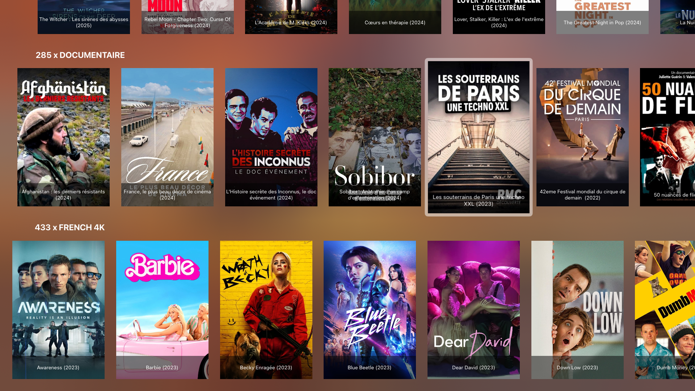
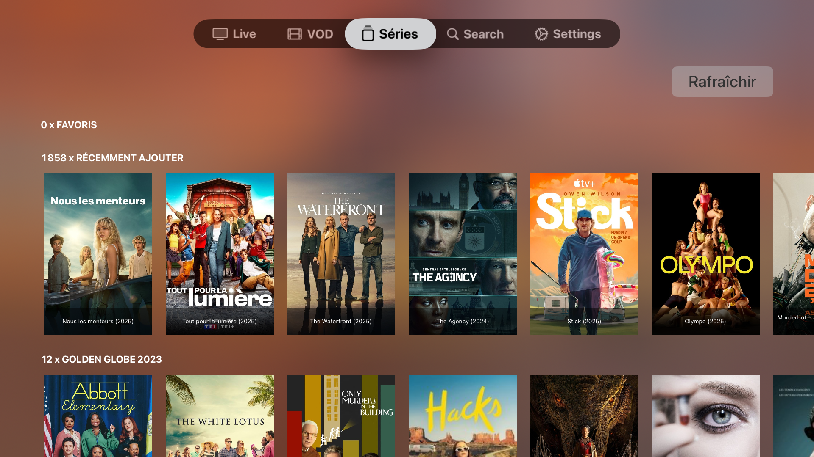

# iOS IPTV Player

An advanced IPTV player application built for iOS using Swift. This project features support for live TV, VOD, and series streaming, with integration for Google Cast and a modular component-based architecture for scalability and maintainability.




## Features

- 📺 **Live TV**, **Movies**, and **Series** browsing and playback.
- 🔍 Integrated search shelves by content type.
- ⭐ Favorite management for quick access to preferred streams.
- 🎬 TMDB image support for visual enrichment.
- 🖥️ Google Cast support for casting to external devices.
- 🎨 Custom UI components like `CircularProgressView`, `Snackbar`, and more.
- 📦 Modular Swift Package-based component organization.

## Architecture

The project is structured into well-defined modules:

- `Components/Library/`: UI components and utilities.
- `Components/Models/`: Models for users, media, favorites, categories.
- `Components/Protocols/`: Protocols for API and cache handling.
- `Components/Resources/Fonts`: Font resources (e.g., Font Awesome).
- `GoogleCast.xcframework/`: Prebuilt framework for Cast integration.

## Requirements

- Xcode 14+
- iOS 14.0+
- Swift 5.7+
- Carthage for dependency management

## Installation

1. Clone the repository:
   ```bash
   git clone https://github.com/your-username/ios-iptv-player.git
   cd ios-iptv-player
   ```

2. Install dependencies with Carthage:
    ```bash
    carthage bootstrap --use-xcframeworks
    ```


3. Google Cast

Ensure that the [GoogleCast.xcframework](https://developers.google.com/cast/docs/ios_sender?hl=fr) is included in the project’s linked frameworks. 
It supports both device and simulator builds.

4.	Open the Xcode project or workspace.

5. License

This project is licensed under the terms of the MIT License.